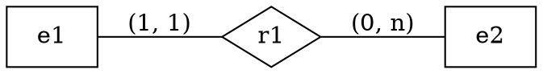
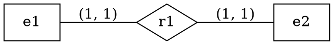
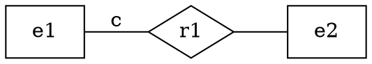
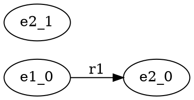
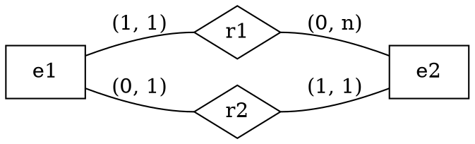

I've been curious for a while about how Alloy and ER diagrams are related.
Both are technically logics for describing relational models.
It makes sense that we should be able to encode ER diagrams in Alloy and get access to the latter's model-finding capabilities.

Here's a straightforward, by-example mapping between both formalisms, paying special attention to the differences.

## Entity sets, relationship sets, and cardinality

A direct way to represent an entity set is as an Alloy [signature](https://alloy.readthedocs.io/en/latest/language/signatures.html).
Relationship sets map to [relations](https://alloy.readthedocs.io/en/latest/language/signatures.html#relations) (or fields) of the signature.

```alloy
sig e1 {
  r1: one e2
}
sig e2 {}
```

The default [multiplicity](https://alloy.readthedocs.io/en/latest/language/signatures.html#signature-multiplicity) of a relation is `one`, declared explicitly here.
This means that `r1` is *one-to-many*: every `e1` is related to exactly one `e2`, but there may be `e2`s not related to any `e1`s.

Here is an equivalent ER diagram[^1]:

<div style="text-align: center" class="theme-affected">




</div>

Relations in Alloy are directed.
To specify the converse cardinality, we can use a signature fact, using `~` to invert the relation:

```alloy
sig e1 {
  r1: e2
}
sig e2 {}{ one this.~r1 }
```

This means that each e1 is associated with exactly one e2 *and vice versa*.

<div style="text-align: center" class="theme-affected">



</div>

Other cardinality constraints use different keywords:

<div style="display: flex; justify-content: center; text-align: center">

| Cardinality constraint | Alloy multiplicity |
| ---------------------- | ------------------ |
| (0, 0)                 | none               |
| (0, 1)                 | lone               |
| (1, 1)                 | one                |
| (1, n)                 | some               |
| (0, n)                 | set                |

</div>

More on encodings [later](#attributes-and-aggregation). Let's look at some applications first.

## Checking properties

With this encoding, we can already reason mechanically about ER diagrams.
For example, we can verify simple properties, such as: that the cardinality constraints we state do what we intend them to.

Cardinality constraints essentially rule out some models. For example, in the following scenario, the constraint $c$ means...

<div style="text-align: center" class="theme-affected">



</div>

<div style="display: flex; justify-content: center; text-align: left">

| Constraint $c$ | Meaning                                                    |
| -------------- | ---------------------------------------------------------- |
| (0, 0)         | prevents e1 from being related to e2 at all                |
| (0, 1)         | prevents e1 from being related to e2 more than once        |
| (1, 1)         | prevents e1 from being related to e2 more or less than one |
| (1, n)         | prevents e1 from being related to e2 less than once        |
| (0, n)         | prevents nothing                                           |

</div>

Given $c$ is (1, 1), all the models of a particular ER diagram should satisfy properties like:

1. All `e1`s are related by `r1`
2. No `e1`s are related by `r1` multiple times

This can all be expressed in Alloy as follows.
The `check` command is used to verify a property, producing a counterexample if it exists within the given finite
[scope](https://alloy.readthedocs.io/en/latest/language/commands.html#scopes).

<!-- <abbr title="the number of signatures in the model">scope</abbr>. -->

```alloy
sig e1 {
  r1: e2
}
sig e2 {}

assert no_unrelated_e1 {
  all e: e1 | some e.r1
}

assert no_multiply_related_e1 {
  no e: e1 | #e.r1 > 1
}

check no_unrelated_e1 for 2
check no_multiply_related_e1 for 2
```

```text
2 commands were executed. The results are:
   #1: No counterexample found. no_unrelated_e1 may be valid.
   #2: No counterexample found. no_multiply_related_e1 may be valid.
```

whereas the same properties will not hold of `e2`, which makes sense because we left it unconstrained.

```alloy
assert no_unrelated_e2 {
  all e: e2 | some e.~r1
}

check no_unrelated_e2 for 2
```

```text
Executing "Check no_unrelated_e2 for 2"
   Actual scopes: 2 e1, 2 e2
   Solver=sat4j Bitwidth=4 MaxSeq=2 SkolemDepth=1 Symmetry=20 Mode=batch
   84 vars. 10 primary vars. 116 clauses. 5ms.
   Counterexample found. Assertion is invalid. 5ms.
```

The counterexample produced demonstrates rather obviously that it is possible to have an `e2` not related to an `e1`.

<div style="text-align: center" class="theme-affected">



</div>

## Generating example models

Alloy is also able to check if a set of constraints is satisfiable, producing a witness.
An immediate use of this is to look at examples of models, to get a feel for what an ER diagram means.

The simplest way to do this is to write a command specifying only the scope

```alloy
run {} for 2
```

and select "Show New Solution" repeatedly.

We can also write constraints to select models, to confirm their presence.
Say we want a model where `e1` and `e2` are related:

```alloy
run { some e: e1 | some e.r1 } for 2
```

## Minimum and maximum cardinality

Finding models can help us answer other kinds of questions, like:

<div style="text-align: center" class="theme-affected">



</div>

Given this ER diagram, and assuming we have 2 `e1`s, how many `e2`s can we have at minimum/maximum?

We encode the ER diagram, then use `run` to see if we can find a model containing 2 `e1`s and 2 `e2`s.
This is possible.
However, there are no satisfying models with more than 2 `e2`s.
Why? They would violate the `lone` constraint, as there would then be two `e2`s related to the same `e1` via `r2`.

```alloy
sig e1 {
  r1: one e2
}{ lone this.~r2 }

sig e2 {
  r2: one e1
}

run {} for exactly 2 e1, exactly 2 e2
run {} for exactly 2 e1, exactly 3 e2
```

```text
2 commands were executed. The results are:
   #1: Instance found. run$1 is consistent.
   #2: No instance found. run$2 may be inconsistent.
```

Similarly, we see that the minimum number of `e2`s is 1.
This is because of the `one` constraint on `r1`.

```alloy
run {} for exactly 2 e1, exactly 1 e2
run {} for exactly 2 e1, exactly 0 e2
```

```text
2 commands were executed. The results are:
   #1: Instance found. run$1 is consistent.
   #2: No instance found. run$2 may be inconsistent.
```

## Programmatic use of Alloy

To build tools on top of this encoding, a way to invoke Alloy programmatically is required.

Alloy [does](https://alloytools.discourse.group/t/commandline-options-clash/214) [not](https://alloytools.discourse.group/t/how-can-i-run-alloy-in-command-line/275) have a CLI.
However, it has a [well-documented Java API](https://alloytools.org/documentation/alloy-api/index.html) and [examples of use](https://github.com/AlloyTools/org.alloytools.alloy/tree/master/org.alloytools.alloy.application/src/test/java/edu/mit/csail/sdg/alloy4whole).
Here's a minimal example of how it might be used to process an Alloy source file and export the resulting model to, e.g., GraphViz or JSON, to interoperate with other tools.
The default XML exporter does not seem to work, crashing when I tried it.

<details>
<summary>Minimal.java</summary>

```java
import edu.mit.csail.sdg.alloy4.*;
import edu.mit.csail.sdg.ast.*;
import edu.mit.csail.sdg.ast.Module;
import edu.mit.csail.sdg.parser.*;
import edu.mit.csail.sdg.translator.*;

public final class Minimal {
  public static void main(String[] args) throws Err {
    A4Reporter rep = A4Reporter.NOP;
    for (String filename : args) {
      Module world = CompUtil.parseEverything_fromFile(rep, null, filename);
      for (Command command : world.getAllCommands()) {
        A4Solution ans = TranslateAlloyToKodkod.execute_command(rep, world.getAllReachableSigs(), command, new A4Options());
        if (ans.satisfiable()) {
          // crashes
          // ans.writeXML("output.xml");
          for (Sig s : ans.getAllReachableSigs()) {
            if (!s.label.contains("this")) {
              continue;
            }
            System.out.println(s.label + ":");
            System.out.println(ans.eval(s, 0));
            for (Sig.Field f : s.getFields()) {
              System.out.println("  " + f.label + ": " + ans.eval(f, 0));
            }
          }
        }
      }
    }
  }
}
```
</details>

<details>
<summary>run.sh</summary>

```sh
#!/bin/bash
jar=/Applications/Alloy.app/Contents/Resources/org.alloytools.alloy.dist.jar
set -ex
javac -cp $jar Minimal.java
java -cp .:$jar Minimal erd.als 2> /dev/null
```

</details>

<!-- <details> -->
<!-- <summary>Attributes and aggregation</summary> -->

## Attributes and aggregation

[A Method for Expressing Integrity Constraints in Database Conceptual Modeling](https://www.scielo.org.mx/scielo.php?script=sci_arttext&pid=S1405-55462020000100075) (2020) is the only other article I found which also discusses encodings.
In Section 4.3.2, they give a translation scheme very briefly.

I agree with their choices for attributes and values and have paraphrased them in the table below.

<div style="display: flex; justify-content: center; text-align: left" class="table-lines">

| ERD           | Alloy                          | Example                                                |
| ------------- | ------------------------------ | ------------------------------------------------------ |
| Domain        | Signature                      | `sig EmpId {}`                                         |
| Value         | Singleton sub-signature        | `one sig John extends EmpId {}`                        |
| Attribute     | Field                          | `sig Employee {id: EmpId}`                             |
| Key attribute | Separate uniqueness assumption | `fact {#employee = #employee.id}` |

</div>

Attributes in ER diagrams are usually simple and do not have much structure, but if we really want, we can now check properties about them.

The remaining choice they make is how to model relationship sets.

> However, we chose to use signatures for representing both the entity types and the relationship types. We think this captures the relationship set semantics more accurately, and provides its own structure.

This is useful for encoding <abbr title="the use of a relationship set as an entity set">aggregation</abbr>.
Here's an example.

```alloy
sig Bottle {}
sig Session {}
one sig Opened {
  rel: Bottle -> lone Session
}
sig Member {}
one sig Tasted {
  rel: Member -> Opened
}

run {} for exactly 1 Session, exactly 2 Bottle, exactly 2 Member 
```

<!-- it seems hard to render aggregation using graphviz -->

The tradeoff is that writing constraints for ternary relations and above [gets complex](https://alloy.readthedocs.io/en/latest/language/signatures.html#multirelations),
and that the default visualization is less intuitive.
It seems better to use Alloy's relations if aggregation isn't required.

<!-- </details> -->

<!-- TODO subtyping, covering, overlap -->

[^1]: We're using [min-max](https://michael-fuchs-sql.netlify.app/2021/03/03/entity-relationship-diagram-erd/#min-max-notation) [notation](https://en.wikipedia.org/wiki/Entity%E2%80%93relationship_model#Cardinalities).