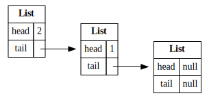
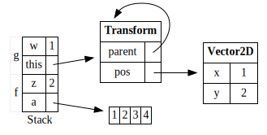
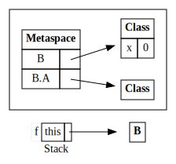

I'm teaching an introductory programming class this semester, which introduced students to the runtime stack and the heap in one of the early tutorials.

For consistency across face-to-face and online classes, I decided to have the diagrams in my slides instead of drawing them terribly over and over.

While there were lots of references for drawing such diagrams by hand, there didn't seem to be any small and simple tools for _generating_ them.
I only found [drawstack.sty](http://tug.ctan.org/tex-archive/macros/latex/contrib/drawstack/) (which does what it says on the box and only handles the stack), and everyone else seemed to use TikZ directly, which felt a little too low-level for this.

So here's a tiny Python DSL for drawing a bunch of heap objects.
It uses the OG constraint-based graphic design tool, GraphViz.

First, a cons list.

</img>

Heap objects are shown with classic box-and-pointer diagrams. This is for Java, so we may have null fields.

```python
c = Obj(typ='List', values={'head': None, 'tail': None}, ident='c')
b = Obj(typ='List', values={'head': 1, 'tail': c}, ident='b')
a = Obj(typ='List', values={'head': 2, 'tail': b}, ident='a')
generate(heap=[a, b, c])
```

Next, the stack.

</img>

It's divided into named _frames_, each of which contains many local variables for a particular function call.
We can show arrays too, and have arbitrary object graphs.

```python
v1 = Obj(typ='Vector2D', values={'x': 1, 'y': 2}, ident='v2')
t1 = Obj(typ='Transform', values={'parent': '_self', 'pos': v1}, ident='t1')
a = Array(values=[1, 2, 3, 4], ident='a')
stack = [
  Frame(fn='g', slots=[
    Slot(name='w', value=1),
    Slot(name='this', value=t1)
  ]),
  Frame(fn='f', slots=[
    Slot(name='z', value=2),
    Slot(name='a', value=a)
  ]),
]
generate(stack=stack, heap=[v1, t1, a])
```

We can also unhygienically embed arbitrary GraphViz strings, to do things like draw boxes around stuff (using a GraphViz `subgraph`, which has the side effect of also grouping everything inside).

</img>

```python
bc = Obj(typ='Class', values={'x': 0}, ident='bc')
ac = Obj(typ='Class', values={}, ident='ac')
metaspace = Obj(typ='Metaspace', values={'B': bc, 'B.A': ac}, ident='meta')
b = Obj(typ='B', values={}, ident='b')
stack = [Frame(fn='f', slots=[
  Slot(name='this', value=b)
])]
generate(stack=stack, heap=[b, bc, ac, metaspace], extra='''
  subgraph cluster_0 { ac; bc; meta; }
''')
```

Code available [here](https://gist.github.com/dariusf/e9b1515f59e6011d566cb6acf13f45a8).
