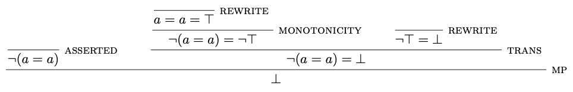
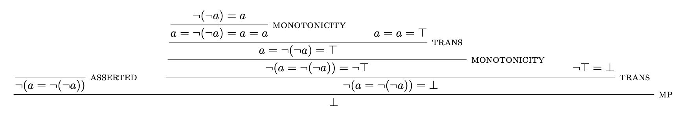
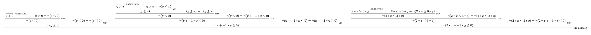
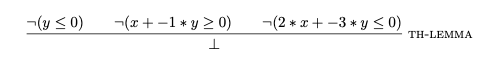

_A writeup of a presentation I gave in class._

SMT solvers like Z3 are often also called automated theorem provers. Why? What do their proofs look like?

An SMT solver tells us if a formula in first-order logic (augmented with various theories) is _satisfiable_[^1]: there is some assignment of variables that makes the formula true. Z3 can even produce such an assignment.

```python
from z3 import *

i = Int('i')
solve(i > 0)
```

```python
[i = 1]
```

Not every formula is satisfiable, though. In that case, there are two possibilities.

Z3 can say `unknown`. This is the less interesting one. It means that Z3 ran out of time or memory, or the algorithm it uses to find the assignment is incomplete, or the problem itself is unsolvable in general. In other words, we don't know for sure if an assignment does not exist.

<!-- https://stackoverflow.com/questions/11197344/z3-produces-unknown-for-assertions-without-quantifiers -->

The other outcome is `unsat`.
This is a much stronger statement than satisfiability, as it means that _every_ assignment of variables must not work.

This has something of the flavour of proving a theorem, where we aim to convince ourselves that a formula is true for _every_ assignment of variables.

We can connect these two views by expressing the theorem we want to prove instead as the non-existence of a _refutation_, or counterexample, to it.
We do this by negating the formula and asking, "is it possible that there is some way for this formula not to be true?"
`unsat` means no, i.e. the theorem is always true.

## Z3's proofs

Z3 has facilities for explaining its deductions, in the form of proofs.
Let's try them on a really simple theorem, $\exists a. a = a$.

<!-- https://stackoverflow.com/questions/49874498/can-i-replay-a-proof-in-z3 -->

```python
from z3 import *

set_param(proof=True)
s = Solver()

a = Bool('a')
f = a == a
s.add(Not(f))

res = s.check()
print(res)
if res == sat:
  print(s.model())
else:
  p = s.proof()
  print(p)
```

Something to note that is that variables in SMT are implicitly existentially quantified. Therefore we are searching for a counterexample by seeing if $\forall a. a \neq a$ is satisfiable.

```python
unsat
mp(asserted(Not(a == a)),
   trans(monotonicity(rewrite((a == a) == True),
                      Not(a == a) == Not(True)),
         rewrite(Not(True) == False),
         Not(a == a) == False),
   False)
```

Unsurprisingly, it is not.
Z3 outputs a _proof tree_, which we can traverse and pretty-print.

</img>

Firstly, we see that the conclusion at the bottom is `False`.
This may seem odd, but recall that the goal is to show that negation of the original theorem cannot be proved, so this is the only conclusion which makes sense.

Next, we see some of Z3's inference rules[^2] in action.
Our original goal is `asserted`.
We have two instances of `rewrite`, where built-in equalities are used to simplify terms.
There is an application of `monotonicity`, where we negate both sides.
Finally we use the `trans`itivity of equality and modus ponens to derive the conclusion.

Let's try $\exists a. a = \neg (\neg a)$.

</img>

And here's another for the linear arithmetic formula $\exists x y. 2 x \leq 3 y, y > x, x > 0$.

</img>

Clearly, these generated proofs quickly get too large to be comprehensible.
They're also largely mechanical and not very meaningful.
Still, it's intriguing to see the automated reasoning that Z3 performs.

A final point about the last one is the application of the rule `th-lemma` to derive the conclusion.

</img>

This is a theory lemma, a placeholder rule for a possibly-opaque decision from a theory solver.

If you want to generate these proofs yourself, the code is [here](https://gist.github.com/dariusf/1fbb17816bea7417e4a104d58d2053d8).

[^1]: For a more thorough introduction to satisfiability, check out [this blog post](https://homes.cs.washington.edu/~emina/blog/2017-06-23-a-primer-on-sat.html#satisfiability-and-validity).
[^2]: There's a more complete list of rules in Section 3.3 of [this paper](https://www21.in.tum.de/~boehmes/proofrec.pdf).
